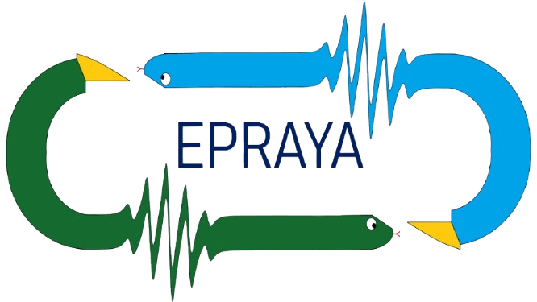

# EPRAYA: Python package for EPR simulation



[](https://pypi.org/project/epraya/)

EPRAYA offers the tools for simulations, fitting and manipulation of EPR (Electron Paramagnetic Resonance) spectroscopic data (cw EPR) in Python. Using only three containers: Ham, Exp and Vary, users can insert hamiltonian parameters, experimental conditions and range for variation of parameters.

It also offers two modes for simulation: 

Classic (CPU): Based in numpy arrays and scipy functions in parallel for simulation and fitting.

With JAX: Based in the JAX package for more efficient calculation and fitting with the ADAM algorithm (GPU use is recommended for faster results).

## Installation 
The recommended installation method is:
```
pip install epraya
```
> [!TIP]
>We recommend to use code editors that support tkinter and plotly (VS Code, Jupyter) to take full advantage of the functions in the package. However, it's possible to use the package in any other code editors.

For further instructions on installation and common question, see the [documentation](./docs/).

## Features

- Simulation of cw EPR single or multiple spin systems of powder or cristal samples.
- Interactive interface for data inspection and manipulation with ease. 
- Identification of energy levels and resonant fields.
- Data fitting with Nelder Mead, Metropolis, Genetic Algorithm, Least Squares and ADAM.
- Plots angular dependance, enegy diagrams, EPR intensity and Absorption curves.
- JAX implemenetation for GPU compatability.
- 
## Documentation

Functions description, tutorials and more specific information, can be access in the [documentation](./docs/).

## Limitations
- Current version of EPRAYA only supports _cw EPR_. We are working in implementing _ENDOR_ and _pulse EPR_.
- EPRAYA supports the simulation to at most 4 interactive spin systems in classic mode and 2 systems with JAX. We expect to improve the calculation times and the possibility to simulate more systems following versions.
- For easier data manipulation, plotly and tkinter support is required.

## Contributions
EPRAYA is a open-code project and contributions are welcome.  If you find an error or bug, would like to improve the code or make the documentation clearer, please let us know by opening an issue or pull request.

## Authors

EPRAYA is a project of the _Física Aplicada_ group of the _Universidad Nacional de Colombia_. The principal contributors to the project are: Juan Sebastián Castro, Ovidio Almanza and Miguel E. Gámez.

## License
[License: MIT](./license/)


